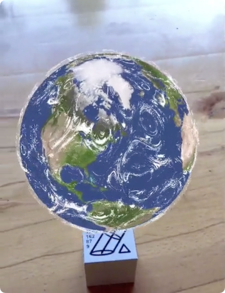
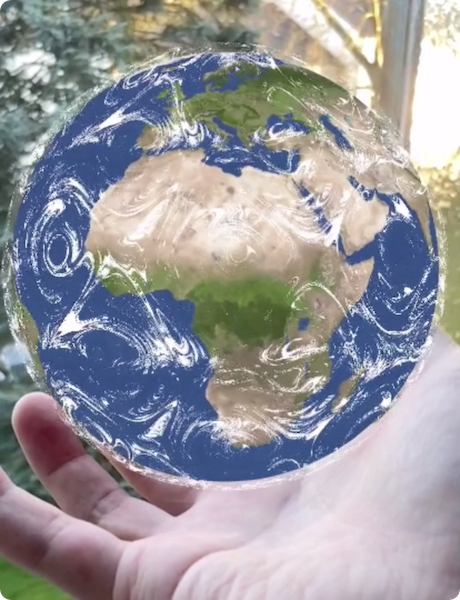

# AR Earth Simulation Data Visualization.					

It's a Marker based AR Projekt.          
Visulization of earth geography with cloud simple simulation.				

## Upcoming Project Features				
This project will support the Web Environments.					
The data visualization is a main change freature.				

- WebAR			
- WebVR
- Interactive
- More Marker / Big Poster
- Import realtime Data
- Visualization umwelt data

## Prototype

				
				
				

### Marker Tracking           
				

### Non Marker Tracking            
				

## openSource Library				
[https://github.com/openframeworks/openFrameworks](https://github.com/openframeworks/openFrameworks)							

[https://github.com/mrdoob/three.js/](https://github.com/mrdoob/three.js/)						
